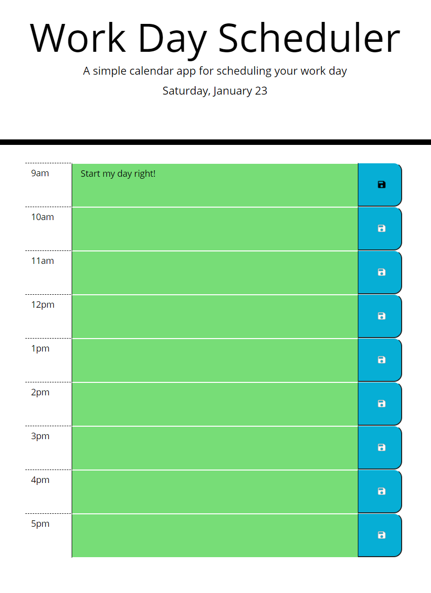
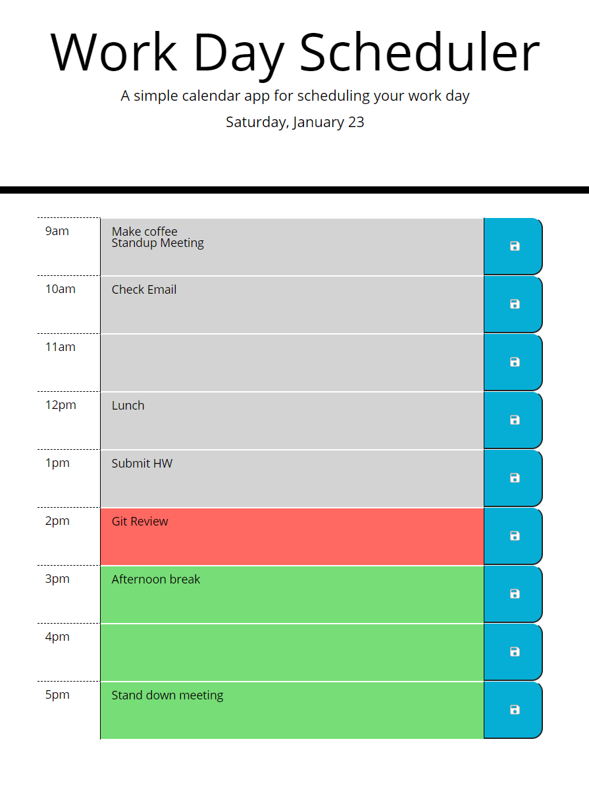

# plan-your-day

An Hourly Workday Planner

## Description

At the top of the page, you will find the application title as well as today's date.

The calendar below breaks the workday into hourly time blocks, and provides a place to store tasks, events, and notes within each block. Hours which have passed are colored gray, the current hour is red, and future hours are green.

## Usage

Click on a block to type in an item, and click the corresponding save button on the right side of the block to store what you entered. When you come back to the page, the items you've entered will remain there for your convenience. Check out the deployed page here: 
https://gregriss.github.io/plan-your-day/

Provided that the time is before 8am, the page will appear like so:

Between 2pm and 3pm, when you've entered several items, clicked save, and refreshed the page, the app might look like this:

## License 

Copyright (c) [2021] [Greg Riss]

Permission is hereby granted, free of charge, to any person obtaining a copy
of this software and associated documentation files (the "Software"), to deal
in the Software without restriction, including without limitation the rights
to use, copy, modify, merge, publish, distribute, sublicense, and/or sell
copies of the Software, and to permit persons to whom the Software is
furnished to do so, subject to the following conditions:

The above copyright notice and this permission notice shall be included in all
copies or substantial portions of the Software.

THE SOFTWARE IS PROVIDED "AS IS", WITHOUT WARRANTY OF ANY KIND, EXPRESS OR
IMPLIED, INCLUDING BUT NOT LIMITED TO THE WARRANTIES OF MERCHANTABILITY,
FITNESS FOR A PARTICULAR PURPOSE AND NONINFRINGEMENT. IN NO EVENT SHALL THE
AUTHORS OR COPYRIGHT HOLDERS BE LIABLE FOR ANY CLAIM, DAMAGES OR OTHER
LIABILITY, WHETHER IN AN ACTION OF CONTRACT, TORT OR OTHERWISE, ARISING FROM,
OUT OF OR IN CONNECTION WITH THE SOFTWARE OR THE USE OR OTHER DEALINGS IN THE
SOFTWARE.